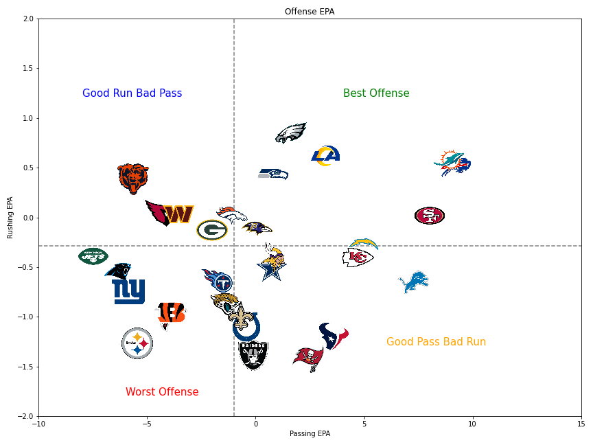
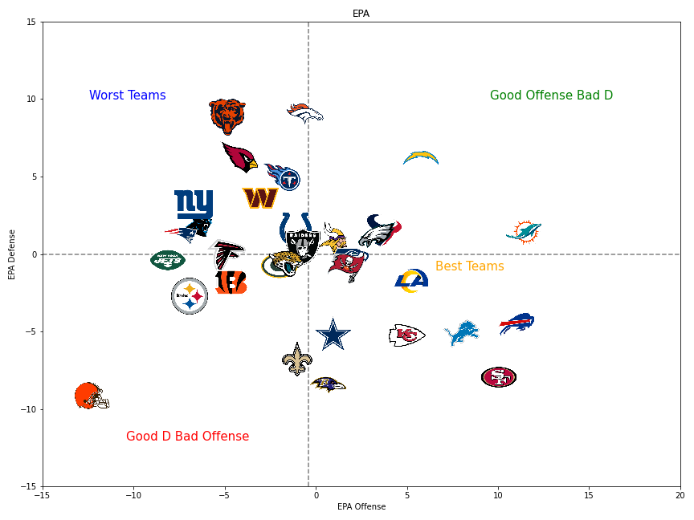

# NFL_2023_stats
Import NFL weekly data for a specific year (e.g., 2023):

Downcast the data types to optimize memory usage and extract specific columns for analysis.

Perform data analysis to create separate dataframes for offense and defense.

Use the K-Means clustering algorithm to classify teams into different classes based on their performance.

Create visualizations of the data, such as EPA (Expected Points Added) comparisons for defense and offense.

Save the visualizations as image files.

